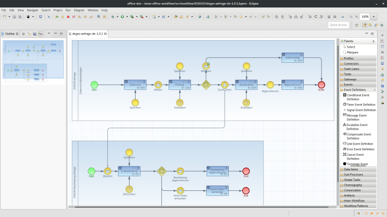

# Imixs-Office-Workflow

'[Imixs-Office-Workflow](https://www.office-workflow.com)' provides a **Open Source Workflow Suite** for small, medium and large enterprises.
The Project is build on top of the '[Imixs-Workflow](https://www.imixs.org)' project and is licensed under the GPL.  

The goal of the project is to provide a powerful and easy-to-use business process management suite for companies and organizations.
With the help of '[Imixs-BPMN](https://www.imixs.org/sub_modeler.html)', business processes can be designed within the BPMN 2.0 standard and easily adapted to the individually needs of an enterprise.

## Open Source
Imixs-Workflow is a free and open source technology. Therefore, this solution can be easily customized and extended with custom plugins and modules. 
You can find further information on the web site [Imixs-Office-Workflow](https://www.office-workflow.com).

* **Blog & News** can be found on the [home page](https://www.office-workflow.com).
* **Release notes** can be read [here](https://github.com/imixs/imixs-office-workflow/releases).
* **Migration notes** can be found [here](MIGRATION-NOTES.md)

## Contribute
The source code of Imixs-Office-Workflow is free available on [Github](https://github.com/imixs/imixs-office-workflow). 
If you have any questions about how Imixs-Office-Worklfow works and how you can use it in your own project, you can ask your question on the [GitHub Issue Tracker](https://github.com/imixs/imixs-office-workflow/issues). 
With a pull request on GitHub you can share your ideas or improvements that you want to contribute.

 
## Quick Installation

To run Imixs-Office-Workflow in a local test environment you can follow the [Quick-Installation Guide](doc/install/README.md). This is a good starting point if you just want to setup a local demo version. 
But please note that Imixs-Office-Workflow is an comprehensive open source project designed for productive enterprise use. A professional use requires a detailed planning of architecture. 

## Modeling
 
In Imixs-Office workflow, you define your business process with BPMN 2.0 – “Business Process Model and Notation “. This is the common standard to model a business process. 

     

Within a BPMN Business Model you can define:

 * The Process Flow
 * Responsibilities
 * E-Mail Notifications
 * Business Rules
 * Forms & Descriptions
    
Imixs-Office-Workflow defines a set of [Standardforms](doc/modeling/STANDARD_FORMS.md) which can be used within a model description.
With the [Custom Forms](doc/modeling/CUSTOM_FORMS.md) you can build your own form element.    
    
    

## Need Help?

[Imixs Software Solutions GmbH](http://www.imixs.com) is an open source company and we are specialized in business process management solutions (BPMS). If you need professional services or consulting for your own individual software project [please contact us](mailto:info@imixs.com). 

 

  

**Imixs-Office-Workflow** provides a Docker Image to run the service on any Docker host. 
The docker image is based on the docker image [imixs/wildfly](https://hub.docker.com/r/imixs/wildfly/) which can be used for development as also for production.

## Docker for Development
Developers can use a docker image for testing and the development of new features. To build a new container first build the maven artefact running: 

	$ mvn clean install -Pdocker

To start Imixs-Office-Workflow with docker, the docker-compose file 'docker-compose-dev.yml can be used:

	$ docker-compose -f docker-compose-dev.yml up

Note: this command will start several containers, 

* a Postgre SQL database server 
* a Wildfly Server running Imixs-Office-Workflow
* and a Wildfly Server funning the [Imixs-Admin tool](https://www.imixs.org/doc/administration.html) 

### Mount Points
The development configuration sets a local mount point at the following location:

	~/git/imixs-office-workflow/src/docker/deployments

Make sure that this directory exits. During development new versions can easily deployed into this directory which is the auto-deployment folder of Wildfly. For further details see the [imixs/wildfly docker image](https://hub.docker.com/r/imixs/wildfly/).

### Prometheus & Grafana
Imixs-Office-Workflow provides also powerful monitoring capabilities. For this purpose you can run a docker stack providing a Prometheus and a Grafana Instance to monitor workflow processing data generated by the Imixs-Workflow engine: 

	$ docker-compose -f docker-compose-prometheus.yml up

The monitor functions are provided by the [Imixs-Prometheus-Adapter](https://github.com/imixs/imixs-adapters/tree/master/imixs-adapters-prometheus), which collects detailed processing information for process analysis and monitoring. 

## Docker for Production

To run Imixs-Office-Workflow in a Docker production environment the project provides several additional maven profiles:

### docker-build

With the profile '_docker-build_' a docker container based on the current version of Imixs-Office-Workflow is created locally
 
	$ mvn clean install -Pdocker-build

### docker-push

With the '_docker-push_' profile the current version of Imixs-Office-Workflow can be pushed to a remote repository:

	$ mvn clean install -Pdocker-push -Dorg.imixs.docker.registry=localhost:5000

where 'localhost:5000' need to be replaced with the host of a private registry. See the [docker-push command](https://docs.docker.com/docker-cloud/builds/push-images/) for more details.

### docker-hub

Imixs-Office-Workflow is also available on [Docker-Hub](https://hub.docker.com/r/imixs/imixs-office-workflow/). The public docker images can be used for development and production. If you need technical support please contact [imixs.com](http://www.imixs.com) 

## Maven Build
Imixs-Office-Workflow is based on [Maven](http://maven.apache.org/) and runs on the Jakarta EE stack. Imixs-Office-Workflow can be deployed on JBoss/Wildfly server or other Java EE application servers.
To build the application from sources, run the maven install command first:

	$ mvn clean install

Please check the pom.xml file for dependencies and versions. The master-branch of the project is continuously under development and is typically 
against the latest snapshot releases form the Imixs-Workflow project. To run a stable version please build a [tagged version](https://github.com/imixs/imixs-office-workflow/releases). 
To deploy the artifact the application server must provide a database pool named "java:/jdbc/office" and a security domain/realm named 'office'. See also the [Imixs-Workflow Deployment Guide](http://www.imixs.org/doc/deployment/index.html) for further details.

