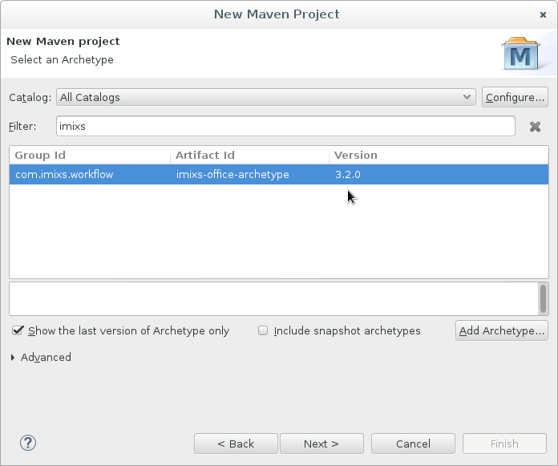

# How to create a custom build from Imixs Office Workflow

There a different ways how you can build and customize Imixs Office Workfow.  One possibility is to check out the Imixs Office Project source and build it from source.  After that you can customize each element of your build. See How to build Imixs Office 
 Workflow This way is typical used if you plan to test, customize and contribute you changes 
 directly to this open source project. The disadvantage of this strategy is that you run out 
 of sync and create a lot of merge conflicts if you work on the trunk version of Imixs Office 
 Workflow.

## Create a custom build from the Imixs Office Archetype

The recommended way to create a custom build from Imixs Office Workflow is using the 
 imixs-office-archetype. In this scenario you create you own custom build based on the 
 latest version of Imixs Office Workflow. You can change the behaviour and layout of your 
 custom build without conflicting with any updates made by the Imixs Marty project. Also 
 you can easily upgrade to any new version of imixs worklow or imixs marty.

## Creating a custom build using Eclipse

To create a new maven project from an archetype you can use the Eclipse IDE with the 
 Maven Plugin (m2e). This Eclipse plugin provides an easy wizard to create a new maven 
 project based on an archetype.

 * 1.) From the main menue choose 'File -> New -> other'

 * 2.) Select 'Maven -> Maven Project' and click next

 * 3.) Leave the default creation setup and click next again

 * 4.) Now search for the Imixs archetype by entering 'com.imixs.workflow'. Eclipse will search the repository for the latest archetype

 * 5.) Click next to setup your project, choose a groupid and artefact id

 * 6.) click finish to create the project

## Create a custom build using maven comandline tool

These are the steps to create you own new custom build using the maven command line:

	mvn archetype:generate -Dfilter=imixs-office

 
 
 