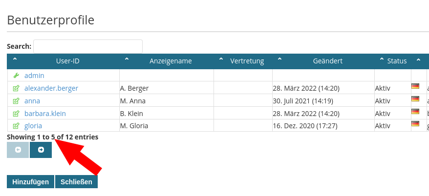

# Administration

The Admin area provides different sections to administrate system configuration

## General Admin Config Paramters

**admin.view.entries.max**

The property  `admin.view.entries.max` defines the maximum entries loaded into the admin view, e.g. Profilelist, Spaces, ....

**admin.view.table.displaylength**

The property  `admin.view.table.displaylength` defines the maximum entries displayed by the JQuery Table Plugin in one page.

**application.url**

The property  `application.url` defines the base URL. This param can be use for example in E-Mail tempaltes:

	Open Link: <propertyvalue>application.url</propertyvalue>index.jsf?workitem=<itemvalue>$uniqueid</itemvalue>

	
**application.title**

The property  `application.title` defines the title displayed in the service navigation
	