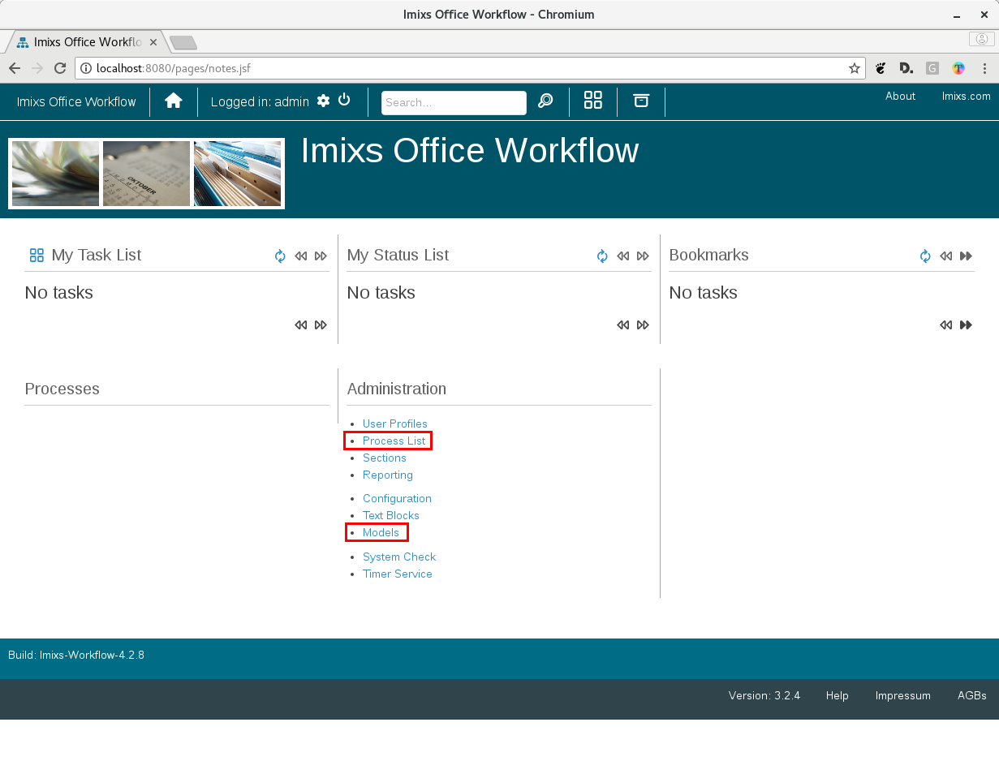
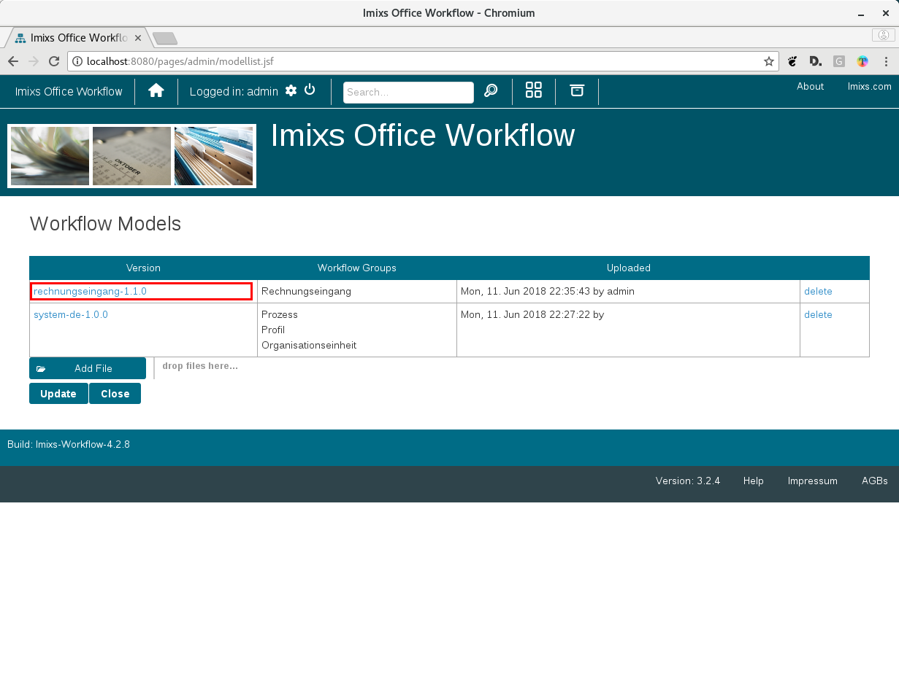
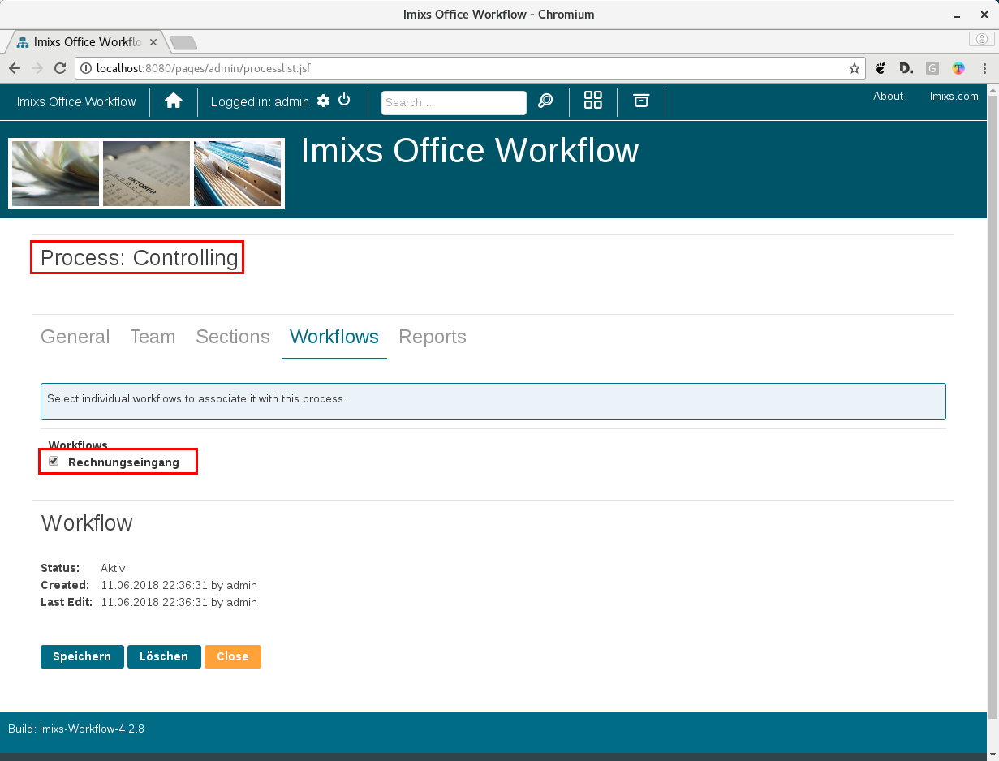
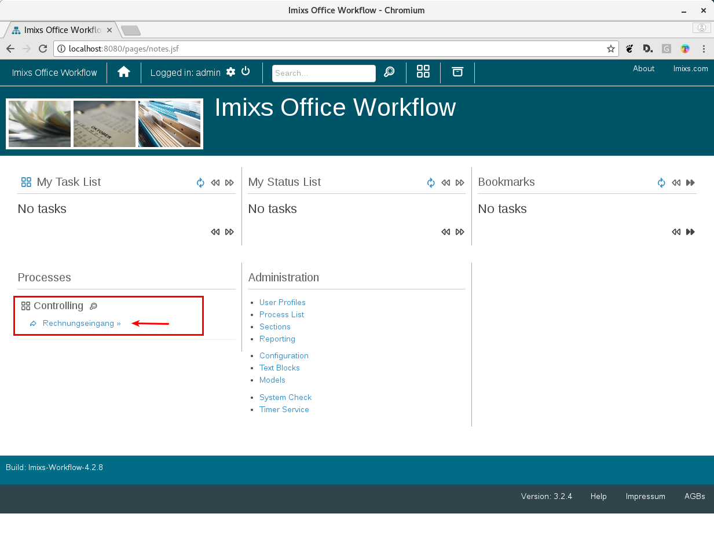

# Quick-Installation Guide for Docker

Imixs-Office-Workflow provides a Docker Container to run the service on any Docker host.
With this Installation guide you can setup an instance of Imixs-Office-Workflow in minutes. 

To follow the installation guide make sure that you have already installed [Docker](https://www.docker.com/community-edition) and also [Docker-Compose](https://docs.docker.com/compose/install/) on your test machine. 

## Install the Application with Docker-Compose

1. Create a working directory on you machine (e.g. /office-workflow/)
2. Copy the [docker-compose.yml](docker-compose.yml) file into work working directory

docker-compose.yml

	version: '3.1'
	
	services:
	
	  db:
	    image: postgres:9.6.1
	    environment:
	      POSTGRES_USER: "imixs"
	      POSTGRES_PASSWORD: "adminadmin"
	      POSTGRES_DB: "office"      
	    volumes: 
	      - dbdata:/var/lib/postgresql/data
	
	
	  app:
	    image: imixs/imixs-office-workflow
	    depends_on:
	      - db
	    environment:
	      WILDFLY_PASS: "adminadmin"
	      POSTGRES_USER: "imixs"
	      POSTGRES_PASSWORD: "adminadmin"
	      POSTGRES_CONNECTION: "jdbc:postgresql://db/office"
	    volumes: 
	      - appdata:/home/imixs
	    ports:
	      - "8080:8080"
	      - "9990:9990"
	      - "8787:8787"
	
	       
	volumes:
	  dbdata:
	  appdata:

## Run the Application

To start Imixs-Office-Workflow run the following docker command from your working directory: 

	docker-compose up

This will start the database and the application server. 
After a few minutes you access the application from your web browser:

[http://localhost:8080/](http://localhost:8080/)
	
You can login with the default account 'admin' with the password 'adminadmin'.

## 	Setup your Application

After Imixs-Office-Workflow is up and running you need to setup a process with a worklfow. 

First upload a BPMN Workflow model. You can find many examples [here](https://github.com/imixs/imixs-office-workflow/tree/master/src/workflow). 
To upload a model go to "Administration >> Models" and add a BPMN file to your model list.

Next create a new Process in the section "Administration >> Processes" and assign the uploaded workflow model with your new process:

Now you will see the new process and its workflow in the home screen under the section 'Processes'. 
You can start the corresponding workflow:

Imixs-Office-Workflow provides a huge list of features to setup a professional Process Management Platform. You will find information in the several sub-projects of [Imixs-Workflow](https://github.com/imixs).

