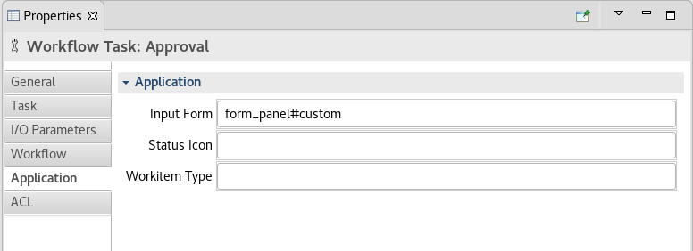
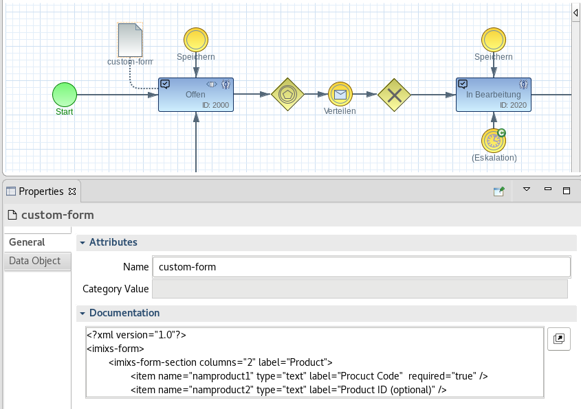
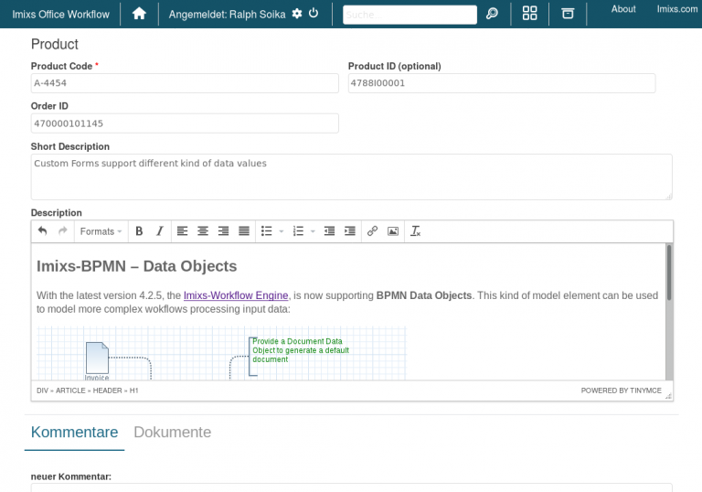

# Custom Forms

With Imixs-Office-Workflow you can create forms completely model-based. No programming knowledge in HTML 
or Java Script is required.
The custom form component enables you to design your forms at runtime. The definition of a custom form is done within the Imixs-BPMN modeler.  To activate this feature you need to add the from "custom" into the section "Application -> Input Form" of your task element.

  

	form_panel#custom

The definition of your custom form is defined by a "Data Object Element" with an association to your task element:

  

## The Form Definition

The XML definition contains sections and items:

	<?xml version="1.0"?>
	<imixs-form>
	  <imixs-form-section label="Controlling">
	    <item name="_description" type="textarea"
	        label="Short Description" />
	  </imixs-form-section>
	  <imixs-form-section>
	    <item name="_details" type="html" label="Description" />
	  </imixs-form-section>
	</imixs-form>
	
  
The following common input formats are supported:

### Text Input

	<item name="_description" type="text"
	        label="Topic" />

### Textarea Input

	<item name="_description" type="textarea"
	        label="Description" />

### HTML/RichText Input

	<item name="_description" type="html"
	        label="Description" />

### Date Input

	<item name="_date" type="date"
	        label="Date" />

### Required Inputs
With the tag 'required' a mandatory input is defined:

	<item name="_date" type="date" required="true"
	        label="Date" />

  

## Form Sections

A custom form is separated by sections. A section can have an optional label and up to 3 columns:

	 ....
	 <imixs-form-section label="Controlling" columns="2">
	 	.....
	 </imixs-form-section>
	 ....
	 