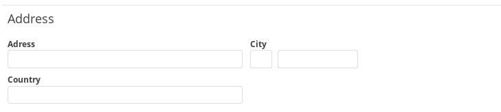
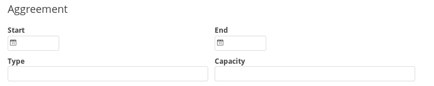
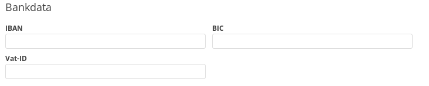
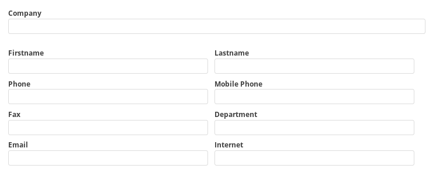
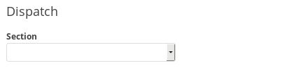
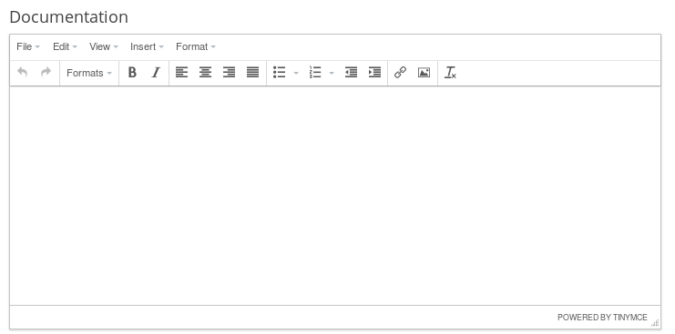
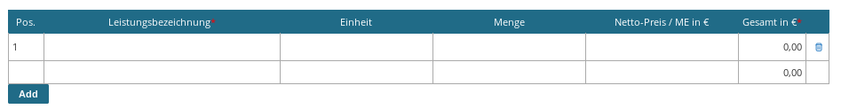

# Standard Forms

Imixs-Office-Workflow defines a set of standard form sections to be defined within model:

To use standard forms you must add the from elements into the section "Application -> Input Form" of your task element.

  

### Example:

	form_panel#basic|sub_dispatch

A Form Definition is started by a Form-Frame followed by a #

	form_panel#...
	
The Form Sections a separated by |

	
	form_panel#basic|sub_documentation|sub_address

# Form Frames

Form Frames are used to separate Form Sections in a Panel-View or in a Tab-View

* form_panel - simple form layout 
* form_tab - form layout with tabs for each section
* form\_panel\_documentviewer - form layout with a document preview
* form\_panel\_instruction - form layout with a instruction section

    
    
# Form Sections

The following Standard Form Sections are available:

## Basic

    basic

## Address

    sub_address

## Agreement

## Bankdata

    sub_bankdata

## Contact

## Dispatch

    sub_dispatch
    

## Documentation

    sub_documenation

## Order Items

    sub_orderitems
    
## Responsible

    sub_responsible

