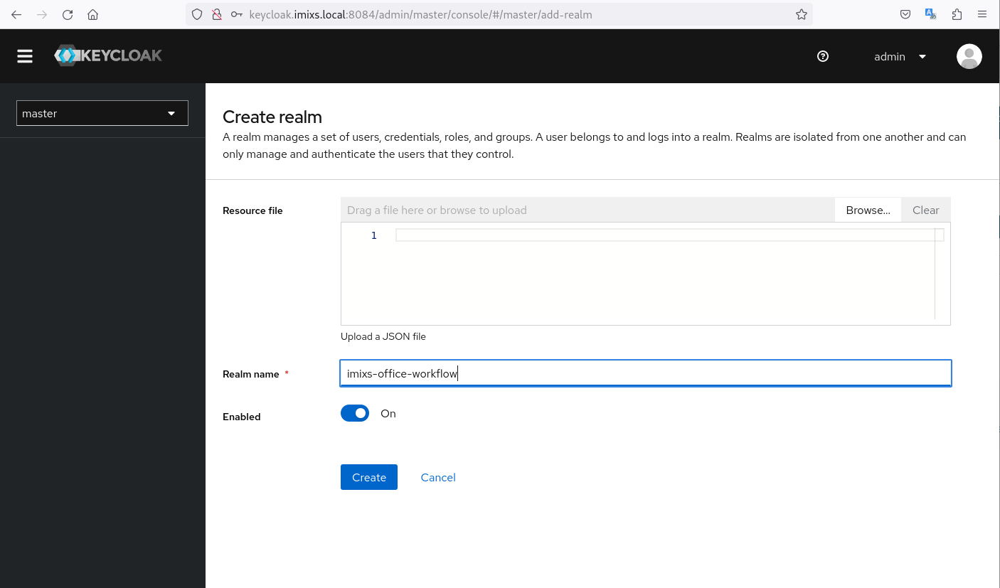
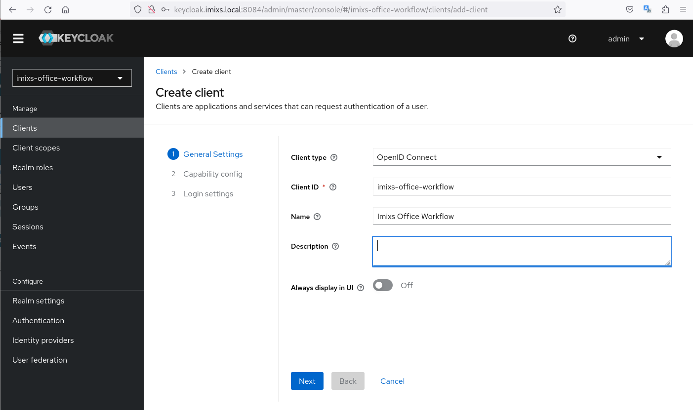
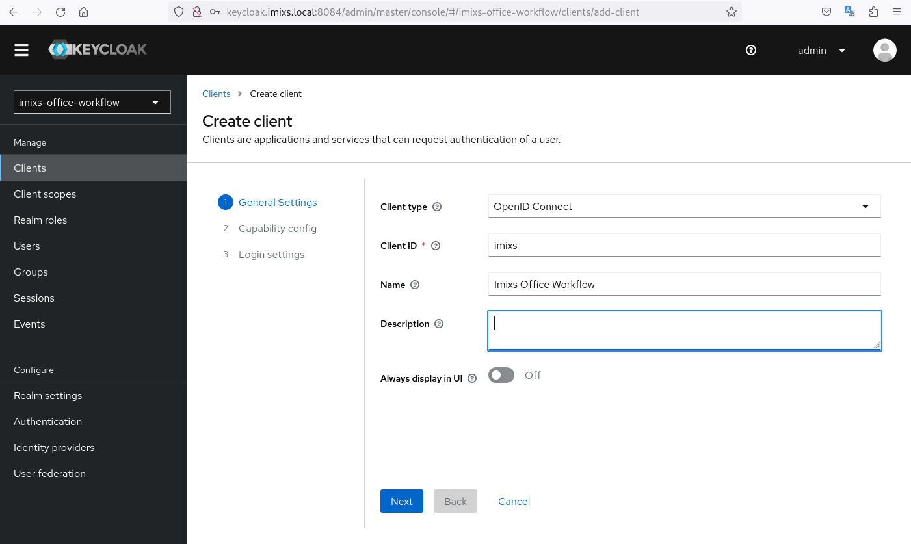
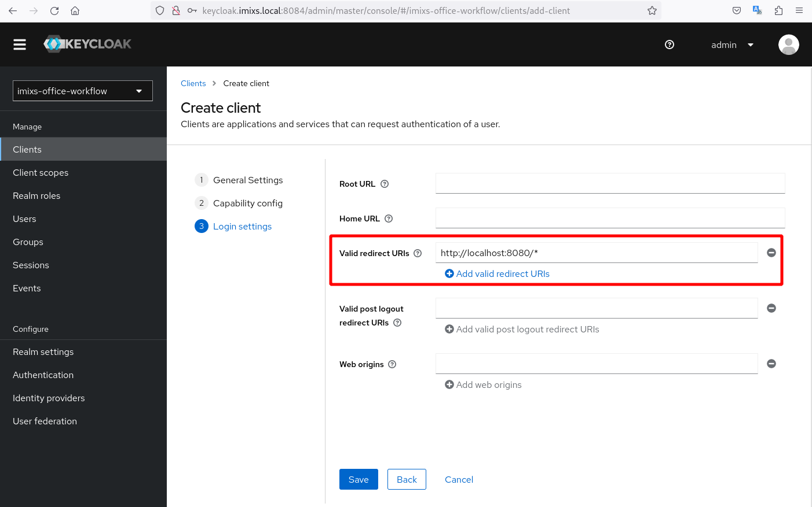
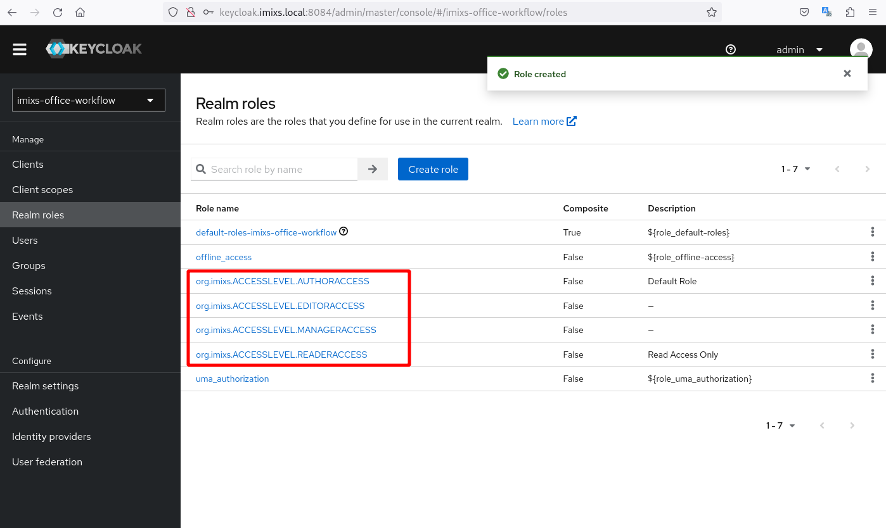
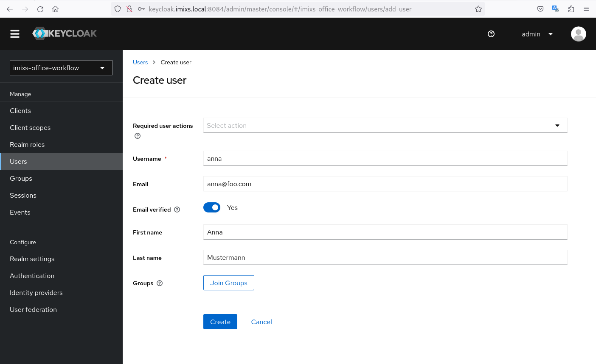
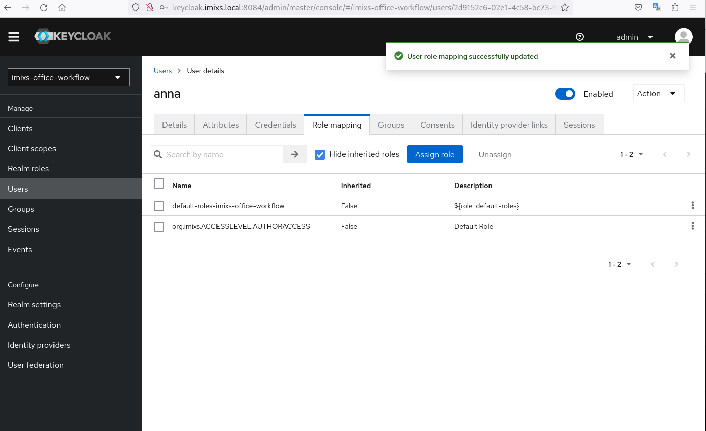

# Keycloak

The following section describes how to run Imixs-Office-Workflow with Keycloak in a local dev environment.

To start the environmen run with:

    $ docker-compose -f docker/docker-compose-keycloak up

Also it is necessary for a local test to create the local hostname `keycloak.imixs.local` pointing to the host loopback interface `127.0.0.1`


You can access the keycloak server via

    http://keycloak.imixs.local:8084

For a first login use the userid `admin` with the password `adminadmin`. You can change these user settings in the docker-compose.yaml file. 


## Setup a Client Realm

First you need to setup a new client Realm within the keycloak server. 

Create a new client with the name `imixs-office-workflow`



This generates a new keycloak 'provider-url' of the OpenID provider. WildFly will use provider-url/.well-known/configuration to discover more information about the OpenID provider. 

In our example, the provider-url will look like http://keycloak.imixs.local:8084/auth/realms/myrealm.


Next create a client with hte name `imixs-office-workflow`




The   `client-id` is the client identifier for the application. This is the identifier that has been registered with the authorization server.


Finally you need to create a new client within your realm with the name `imixs`:



and add the redirect URI `http://localhost:8080/*`





To test the OIDC provider capabilities you can request the configuration URL in your web browser:

    http://keycloak.imixs.local:8084/realms/imixs-office-workflow/.well-known/openid-configuration


## Create Roles 

Next create the following Realm Roles 

- org.imixs.ACCESSLEVEL.READERACCESS
- org.imixs.ACCESSLEVEL.AUTHORACCESS
- org.imixs.ACCESSLEVEL.AUTHORACCESS
- org.imixs.ACCESSLEVEL.MANAGERACCESS




## Create Users

Now you can create new User Accounts 



and assign these users to one of the roles:



Also don't forget to set the password for the new user via the tab 'Credentials'. 

## Use OIDC with Keycloak and Imixs-Office-Workflow

[OpenID Connect](https://openid.net/connect/) is an identity layer on top of the OAuth 2.0 protocol. OpenID Connect makes it possible for a client to verify a user’s identity based on authentication that’s performed by an OpenID provider.

WildFly 25, which is used by the latest version of Imixs-Office-Workflow, added the ability to secure applications using OpenID Connect, without needing to make use of the Keycloak client adapter. To integrate Keycloak, WildFly 25 introduced a new elytron-oidc-client subsystem that scans deployments to check if the OpenID Connect (OIDC) authentication mechanism is needed. If the subsystem detects that the OIDC mechanism is required for a deployment, the subsystem will activate this authentication mechanism automatically. This feature makes it easy to connect Imixs-Office-Workflow with Keycloak. 


## Wildfly - Disable JASPIC

One tricky point is that by default the elytron subsystem enforces the logged user to be in the default other domain (by default application users are placed in the application-users.properties file in wildfly). The integrated-jaspi option can be set to `false` to avoid that. 

This can be done by either editing the standalone.xml file:

```xml 
 ....
 .........
        <subsystem xmlns="urn:jboss:domain:undertow:13.0" default-server="default-server" default-virtual-host="default-host" default-servlet-container="default" default-security-domain="other" statistics-enabled="${wildfly.undertow.statistics-enabled:${wildfly.statistics-enabled:false}}">
           .......
           .............
            <application-security-domains>
                <!-- Disable integrated jaspic -->
                <application-security-domain name="other" security-domain="ApplicationDomain" integrated-jaspi="false"/>        
            </application-security-domains>
        </subsystem>
    .....
```

or with the cli-commandline tool:

    $ ./jboss-cli.sh --connect --controller=remote+http://localhost:9990
    $ /subsystem=undertow/application-security-domain=other:write-attribute(name=integrated-jaspi, value=false)
    $ relaod


See also https://blogs.nologin.es/rickyepoderi/

## The Configuration (deprecated!)

The configuration that indicates that the OIDC authentication mechanism is needed by an application can either be provided within the application itself or within the elytron-client-oidc subsystem.

The easiest way is to add a file 'oidc.json' to your WEB-INF/ folder with the following content:

```json 
{
    "client-id" : "imixs",
    "provider-url" : "${env.OIDC_PROVIDER_URL:http://keycloak.imixs.local:8084}/realms/imixs-office-workflow",
    "public-client" : "true",
    "principal-attribute" : "preferred_username",
    "ssl-required" : "EXTERNAL"
}
```


and also change the login configuration in your `web.xml` file to:


```xml
 	<login-config>
        <auth-method>OIDC</auth-method>
    </login-config>
```

Redeploy your application. 

Thats it.


See also: 

 - https://wildfly-security.github.io/wildfly-elytron/blog/securing-wildfly-apps-openid-connect/
 - https://auth0.com/blog/jakarta-ee-oidc/

